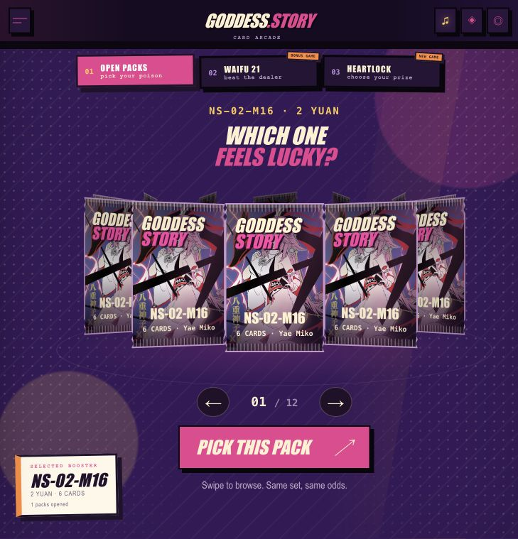
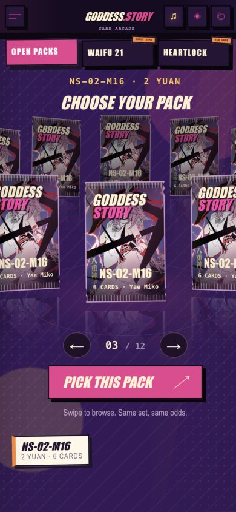
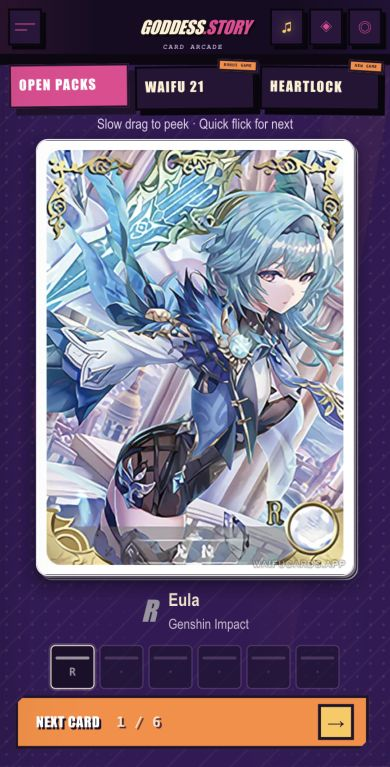
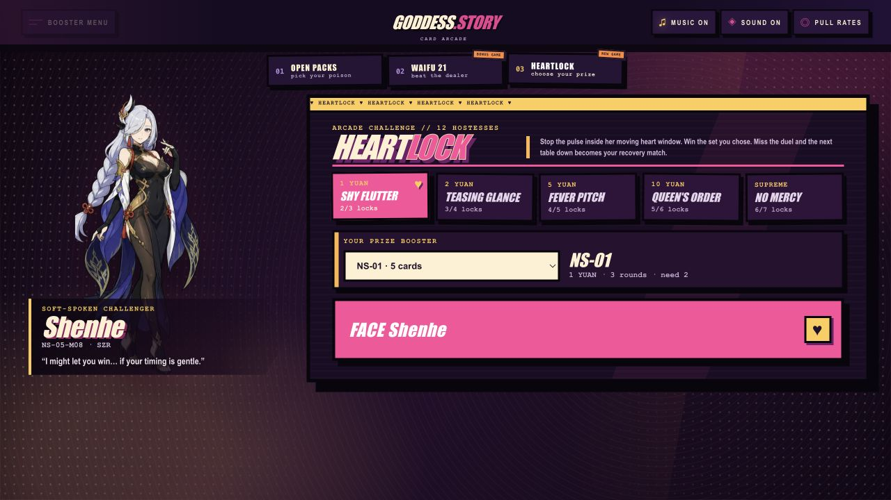
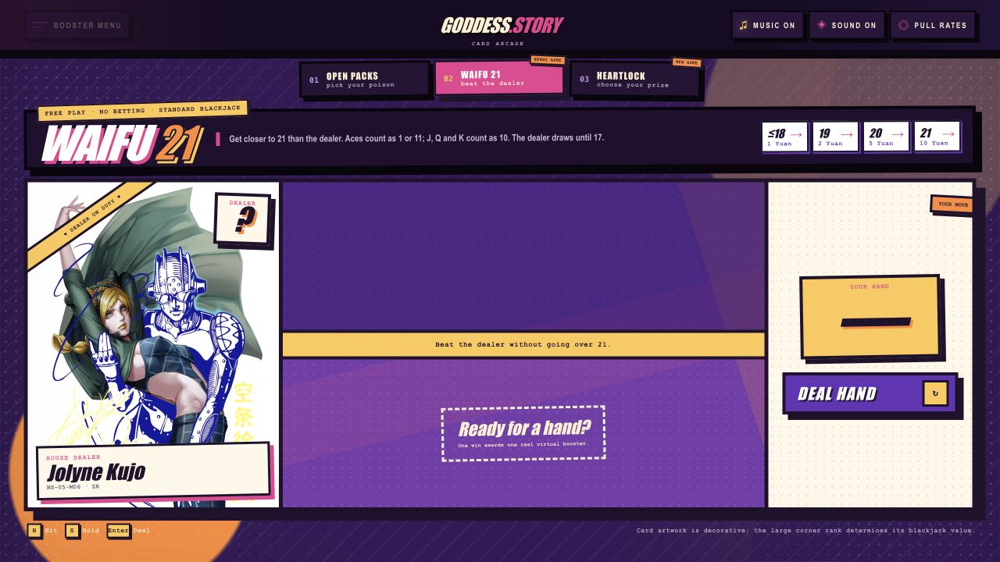

# Goddess Story Arcade

[](https://github.com/Kilian3000/goddess-story-arcade/actions/workflows/ci.yml)

A fan-made browser arcade for Goddess Story boosters.

This started with a simple problem: opening digital packs felt flat. Browse a ring of boosters, pick the one that feels lucky, rip the wrapper, and work through the cards. The binder tracks set completion, and the arcade has skill, house, card, rip, and gēsen tables.

Everything needed to run it is in this repository, including the card catalog and artwork. No account, API key, tracker, or separate image server is required.

> **18+ project:** some cards and character artwork are suggestive or NSFW.



## New in 0.4

Omikuji and midnight change the altar mood, not the odds. Last Pack Standing and a rare God Pack sit next to Sister's Rip. The hub gained a Gēsen group (Gachapon, UFO Catcher). The binder now has an Oshi route, night market, yearbook, Purikura, and optional Kabufuda patience. Notes: [docs/releases/v0.4.0.md](docs/releases/v0.4.0.md).

## New in 0.2

The pack carousel is purely for fun: all twelve positions have the same odds. Swipe to spin it, tap a side pack to bring it forward, then pick one up to open. You can change your mind before ripping.

On phones, a slow drag tilts the stack and exposes the opposite edges. A quick flick in any direction reveals the next card—never the previous one. Tap the card for details.

<p align="center">
  
  
</p>

## What is in here?

- **Open Packs:** 47 booster configurations across the 1, 2, 5, 10, and 20 yuan lines.
- **Pick your pack:** a looping, swipeable booster carousel with momentum and snap-to-pack selection. No odds tricks.
- **Pack collation that makes sense:** cards are drawn from ordered rarity slots instead of one flat random pool. Exact duplicate cards are blocked inside a single pack.
- **Proper pack-opening feedback:** ripping, card swipes, rarity effects, keyboard/touch controls, sound effects, and procedural music.
- **Binder / Dex / Schrein:** owned cards, missing set slots, character progress, chase pins, and a 3×3 display.
- **Daily 1¥ pack:** one free rip every 12 hours. Soft pity charges after a dry set streak.
- **Skill tables:** Waifu 21 and Heartlock still award one pack per game per day; extra wins pay a little Yuan. Memory, Duel, The Mind, and Snap use your collection art.
- **House / Cards / Rips / Gēsen:** Crash, Roulette, Mines, Hi-Lo, Jackpot, Coinflip, Upgrader, War, Monte, Cabo, Scopa, Love Letter, Koi-Koi, Pack Battle, Sister's Rip, Last Pack, Gachapon, and UFO Catcher.
- **Local saves:** wallet, collation, pull history, and arcade meta stay in the browser.

<p align="center">
  
  
</p>

## Run it locally

You need Node.js 22.13 or newer.

```bash
git clone https://github.com/Kilian3000/goddess-story-arcade.git
cd goddess-story-arcade
npm ci
npm run dev
```

Then open [http://localhost:3000](http://localhost:3000).

Useful commands:

```bash
npm run dev      # development server
npm run build    # production build
npm run lint     # lint source and tests
npm test         # game logic, assets, audio contracts, build, and rendering
```

## Docker

```bash
docker compose up --build
```

The app will be available on port `3000`. The included Compose file is intentionally generic, so it can be dropped into Portainer or another deployment without carrying private server details with it.

## Card data

The repository includes a read-only snapshot with 7,013 card records and the matching card/set images under `public/card-data`.

The default paths are:

- `/card-data/db.js`
- `/card-data/images/...`

If a deployment needs a different catalog or image source later, copy `.env.example` and set the `NEXT_PUBLIC_CARD_*` values. The game code does not need to be changed. The expected database shape and reintegration steps are in [INTEGRATION.md](INTEGRATION.md).

## Where things live

- `app/page.tsx` — main arcade and pack-opening flow
- `app/pack-draw.ts` — shared pack fill, box meter, reveal marks
- `app/arcade-meta.ts` — chase, shrine, dailies, pity, pull history
- `app/collection/page.tsx` — binder, dex, shrine
- `app/minigames/` — hub and all arcade tables
- `app/gacha-engine.ts` — pack recipes and rarity collation
- `app/lucky-shrine.tsx` — Waifu 21
- `app/temptation-duel.tsx` — Heartlock
- `public/pack-configs.json` — booster configurations
- `public/card-data` — bundled catalog and artwork
- `tests` — pull logic, economy, meta, odds, and rendering checks

## Contributing

Pull requests are welcome. Please read [CONTRIBUTING.md](CONTRIBUTING.md), keep suggestive character art unmistakably adult, and run `npm test` before pushing.

## Disclaimer

This is an unofficial, non-commercial fan project. It is not affiliated with Goddess Story, WaifuCards, or any represented franchise. Character names, likenesses, trademarks, and card artwork belong to their respective owners. See [NOTICE.md](NOTICE.md) for the asset and data notes.
